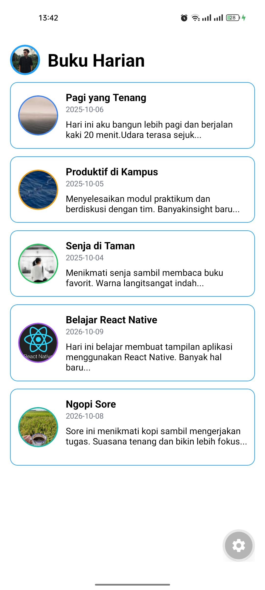

# Diary App

Aplikasi Diary sederhana yang dibuat menggunakan React Native dan Expo sebagai bagian dari tugas praktikum Pemrograman Mobile Multiplatform.

## Disusun Oleh

**Nama:** Muhamad Dikrulloh<br>
**NIM:** 2430511076

## Cara Menjalankan Project

1. Clone repository atau download project.
2. Buka terminal pada folder project.
3. Install dependency:

```
npm install
```

4. Jalankan aplikasi menggunakan Expo:

```
npx expo start
```

5. Scan QR Code menggunakan Expo Go pada perangkat Android atau jalankan melalui emulator.

## Dependency

Project ini menggunakan:

- React Native
- Expo
- react-native-safe-area-context

## Fitur yang Diselesaikan

- Menambahkan dua entri diary baru.
- Menggunakan gambar remote dan lokal dari folder `assets/moods`.
- Menampilkan avatar pengguna pada bagian header menggunakan `Image`.
- Menambahkan variasi border dan outline pada card berdasarkan mood.

## Screenshot

Screenshot aplikasi yang berjalan menggunakan Expo Go:

<p align="center">
  
</p>
